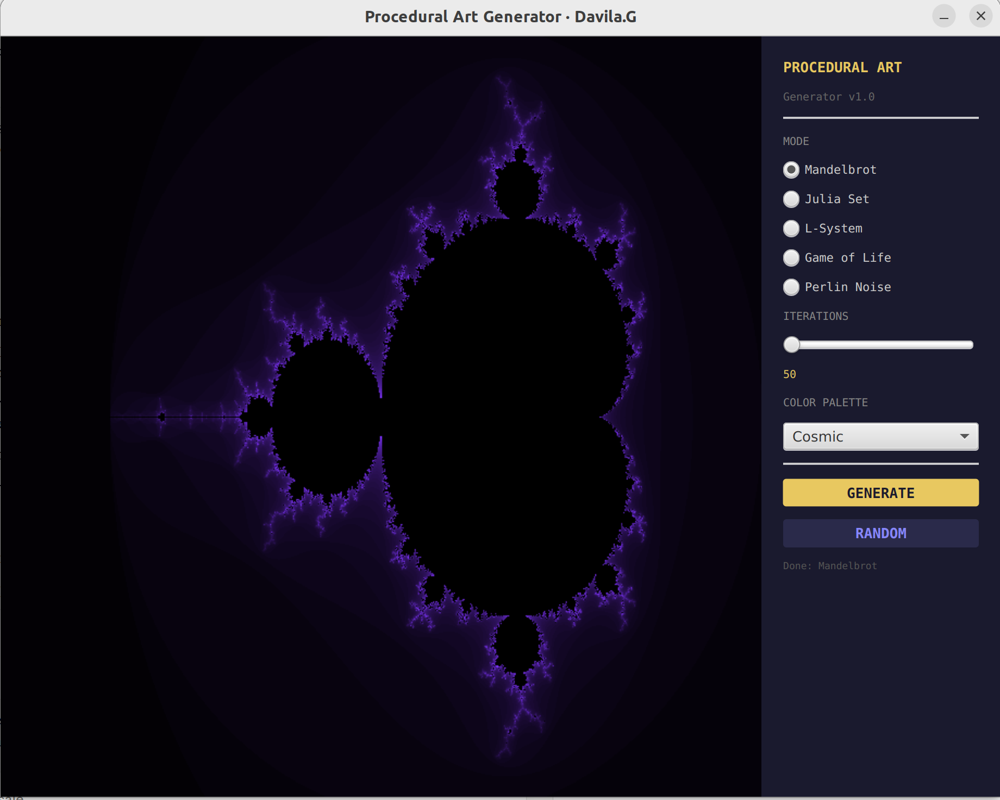
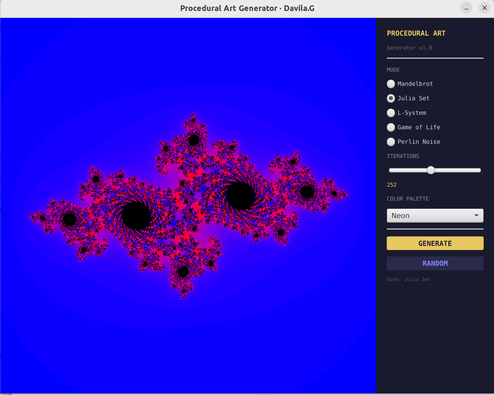
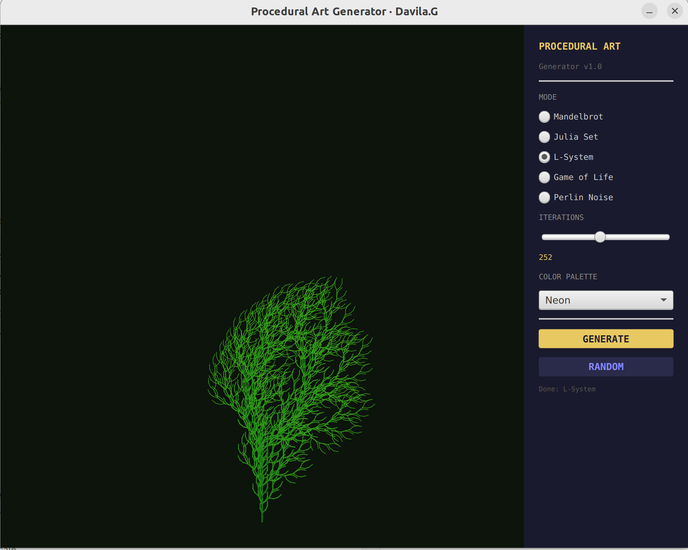
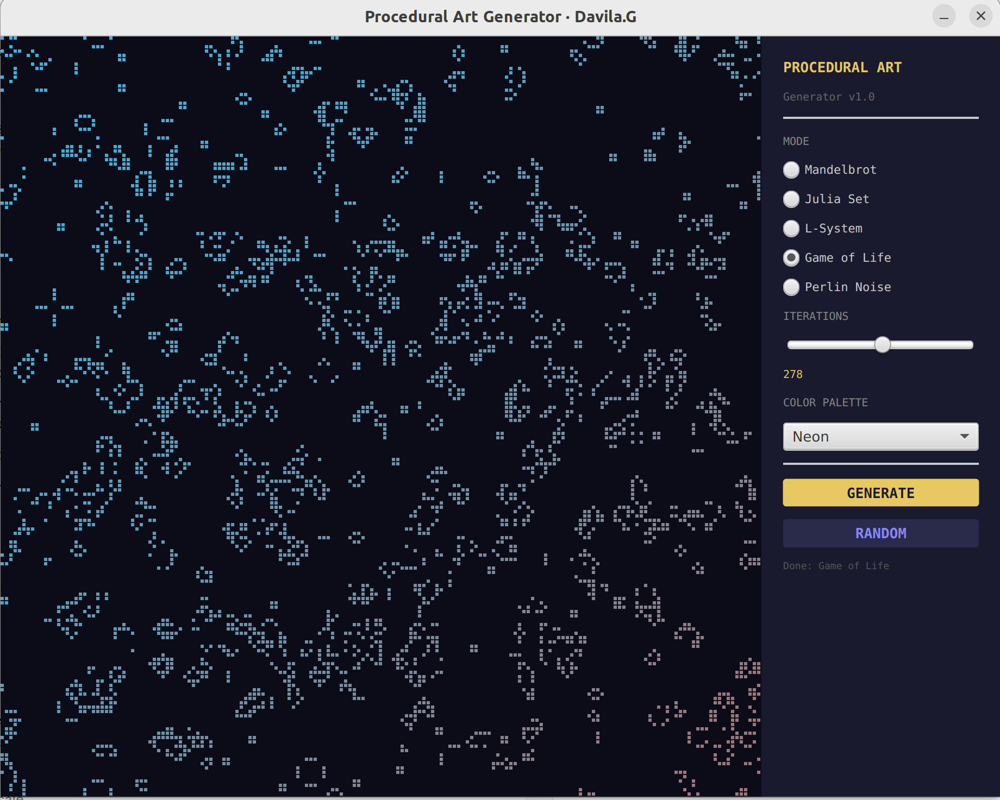
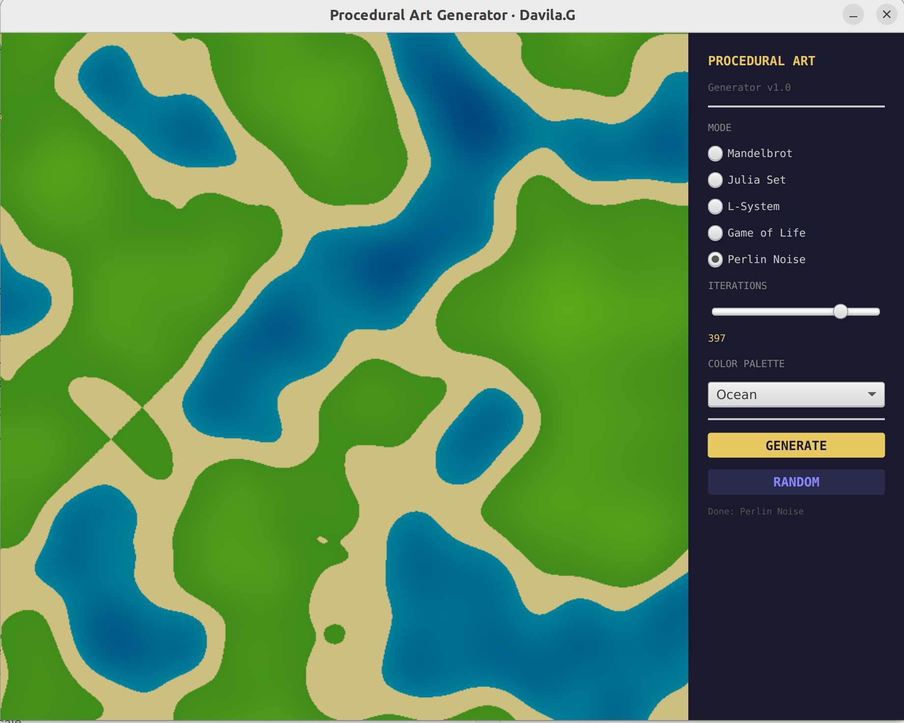

# Procedural Art Generator

A desktop application that generates infinite visual art using mathematical algorithms. Built with Java 11 and JavaFX.



## Features

Five generation modes, each powered by a different algorithm:

- **Mandelbrot Set** — Classic fractal explorer. Colors represent how quickly each point escapes to infinity.
- **Julia Set** — A variation of the Mandelbrot set with a fixed complex constant, producing organic, symmetrical patterns.
- **L-System** — Lindenmayer grammar-based plant simulation. A simple rewriting rule applied recursively generates realistic botanical structures.
- **Game of Life** — Conway's cellular automaton. Random initial state evolves through 80 generations before rendering.
- **Perlin Noise** — Coherent gradient noise used to generate natural-looking terrain maps.

Five color palettes: Cosmic, Fire, Ocean, Forest, Neon.

## Screenshots

| Mandelbrot · Cosmic | Julia Set · Neon |
|---|---|
|  |  |

| L-System | Game of Life |
|---|---|
|  |  |

| Perlin Noise · Ocean |
|---|
|  |

## Tech stack

- **Java 11**
- **JavaFX 17** — UI and canvas rendering
- **Maven** — dependency management and build

## Architecture

```
src/main/java/com/davilag/
├── App.java                        # Entry point, bootstraps JavaFX
├── ui/
│   └── MainWindow.java             # Main window, controls and layout
└── generators/
    ├── MandelbrotGenerator.java    # Mandelbrot set renderer
    ├── JuliaGenerator.java         # Julia set renderer
    ├── LSystemGenerator.java       # Lindenmayer system tree
    ├── GameOfLifeGenerator.java    # Conway's Game of Life
    └── PerlinGenerator.java        # Perlin noise terrain
```

Each generator implements a single `draw(GraphicsContext gc)` method, making it easy to add new algorithms.

## Getting started

**Requirements:** Java 11+, Maven 3.6+

```bash
git clone https://github.com/saradavilag/procedural-art.git
cd procedural-art
mvn package -DskipTests -q
mvn dependency:copy-dependencies -q
java --module-path target/dependency --add-modules javafx.controls,javafx.fxml \
     -cp target/procedural-art-1.0.0.jar com.davilag.App
```

## How it works

**Mandelbrot & Julia** — For each pixel, iterate the function z = z² + c and count how many steps before |z| > 2. Map that count to a color.

**L-System** — Start with axiom `F`. Apply rule `F → FF+[+F-F-F]-[-F+F+F]` four times. Interpret the resulting string as turtle graphics commands: `F` = draw forward, `+/-` = rotate, `[/]` = push/pop position stack.

**Game of Life** — Initialize a random grid, evolve 80 generations using the standard rules (live cell survives with 2-3 neighbors, dead cell becomes alive with exactly 3), then render the final state.

**Perlin Noise** — Two octaves of smooth gradient noise combined at different frequencies and amplitudes, then mapped to terrain colors by height threshold.
